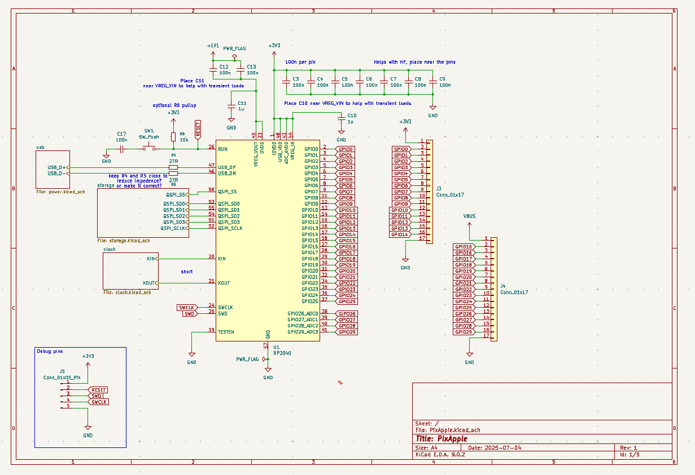
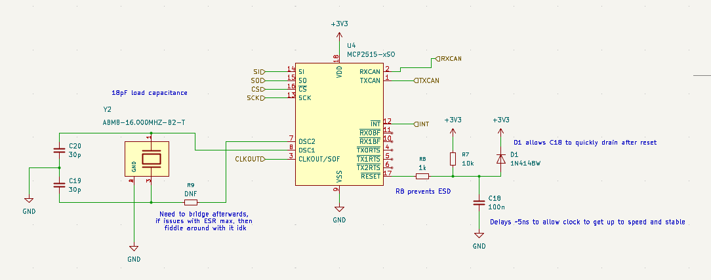
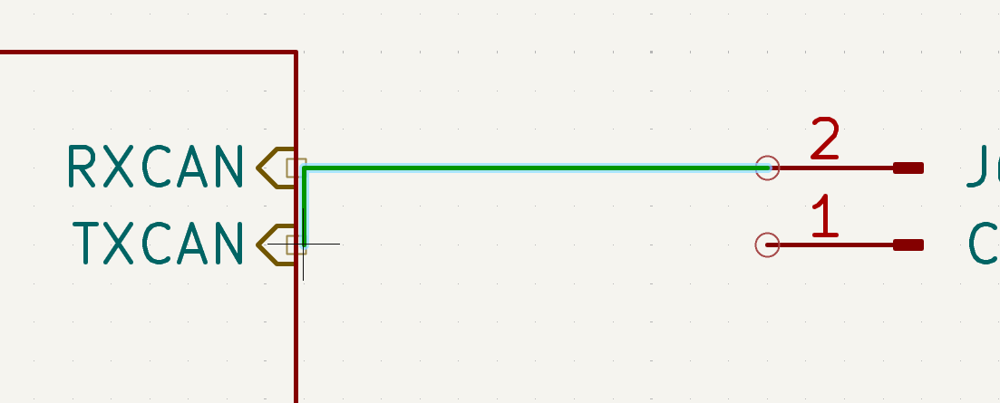
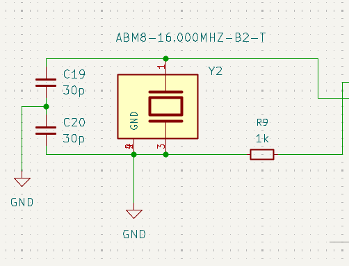
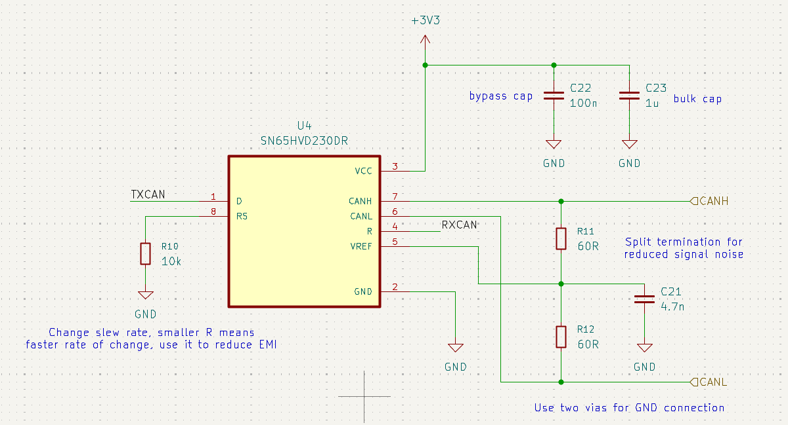
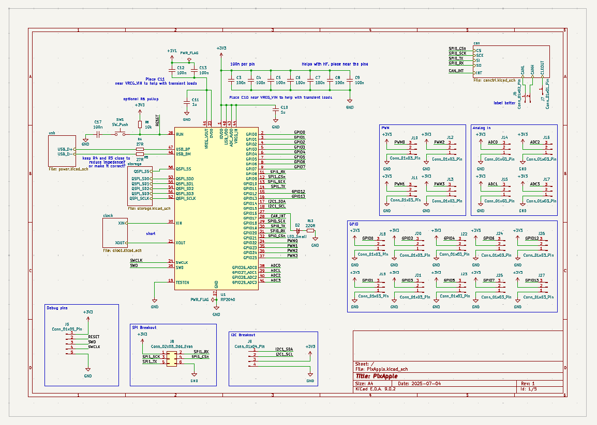
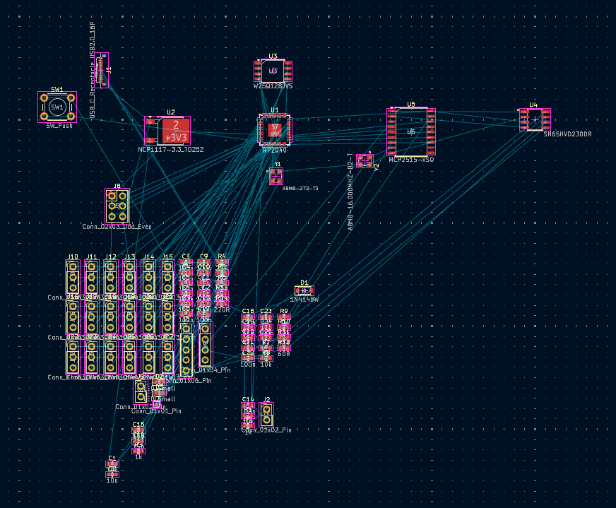

# 2025-07-04 - Where to begin (5 hours)

This is a starter project so I can learn how to actually design a keyborad with the RP2040.
So far I've decided on Bluetooth support + battery charging.
I'm tempted to make it waterproof, whatever that means for a development board, so I can stick it in a submarine sometime in the future. Who knows. Maybe.
So far I've done the relatively basic task of setting it up with the power capacitors, pull up resistors and the likes. Only gripe I have right now is reading documentation is a chore.

# 2025-07-05 - CAN we do it? no (3 hours)

I want CAN. It'll make routing logic/commands/data to and from various parts a lot easier. Only problem is I have no idea what controllers to use. A preliminary search shows that the MCP2515 the CAN controller is a good fit but the transmitter the MCP2551 isn't. MCP2515 can handle +3V3 while MCP2551 needs +5V. So we're ditching MCP2551 for SN65HVD230. Whoever named these needs to be uhhh.... questioned.

Work is slow. So many pages of documentation on documentation. Mainly getting the crystal oscillator and reset pin of all things working. And guess what! My hirearchical sheet was drawn in the wrong grid size because I somehow clicked N by accident. That screws up all the tags and you can't connect to them. Now I have to redraw the sheet. I hate KiCAD sometimes. Why on earth would it let you change grid size if it'll break everything in the schematic??? I'm sleeping now.

# 2025-07-06 - CAN re-schematic (5 hours)

Redo following (https://ww1.microchip.com/downloads/en/DeviceDoc/MCP2515-Stand-Alone-CAN-Controller-with-SPI-20001801J.pdf). Hopefully it went fine. The only thing that I'm slightly sketched out by is the series resistor R9 in the CAN clock. I'm not really sure how to calculate it and the ABM8-16MHz datasheet says nothing about it (https://abracon.com/Resonators/abm8.pdf). For now I'll just use the same resistor the RP2040 docs said to use with the ABM8-272 but hey at least I can desolder it if needed.

Use this to figure out what pins the IC can actually connect to (https://datasheets.raspberrypi.com/rp2040/rp2040-datasheet.pdf).

DRC finally has no complaints! I hate rewiring though. Time to add the CAN transmitter (https://www.ti.com/lit/ds/symlink/sn65hvd230.pdf?ts=1751731839553). Yippee JLCPCB has it as a part (how much does assembly cost... I'm scared this'll be super super expensive). We're doing split termination on the CAN bus because we can. Also because I dunno if my signal will be clear at all so I'd much rather have a working CAN bus than a dysfunctional one. I finished schematic-ing up the CAN controller, the MCP2515 and the transmitter, the SN65HVD230DR.

# 2025-07-07 - Breakout (8 hours)

https://youtu.be/ySuUZEjARPY
Goated video.

Finished the schematic. Hopefully.

Added all footprints.

That was a total mess. I'll finish the rest of it tomorrow. Routing the CAN chip looks fun. The lines are all crossed and I'm scared that the vias will mess up the ground plane somehow.
