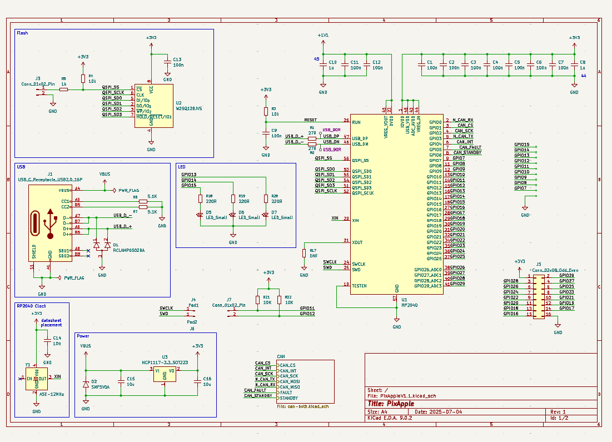
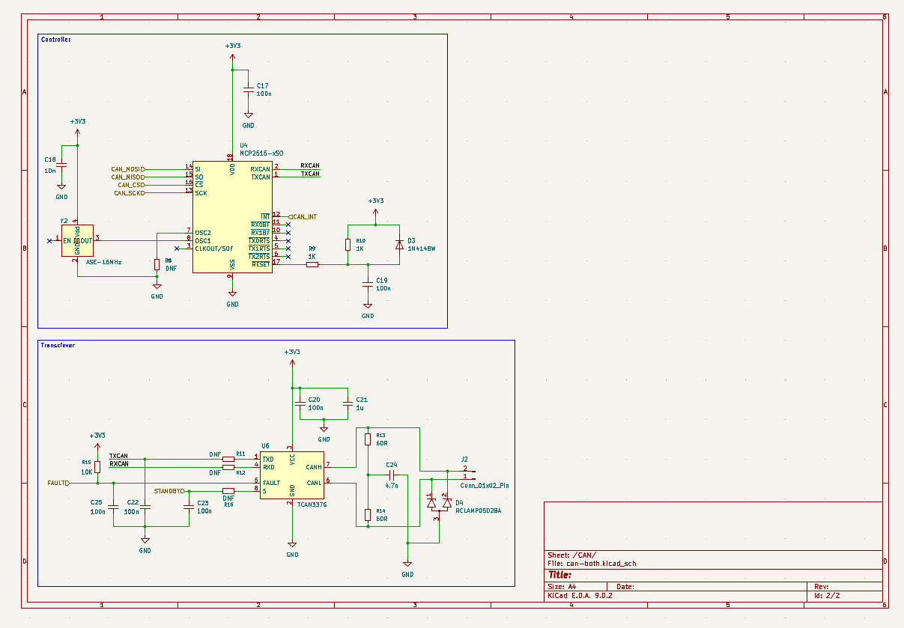
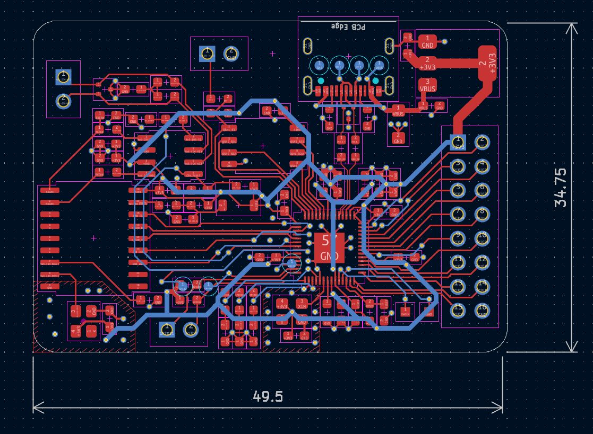
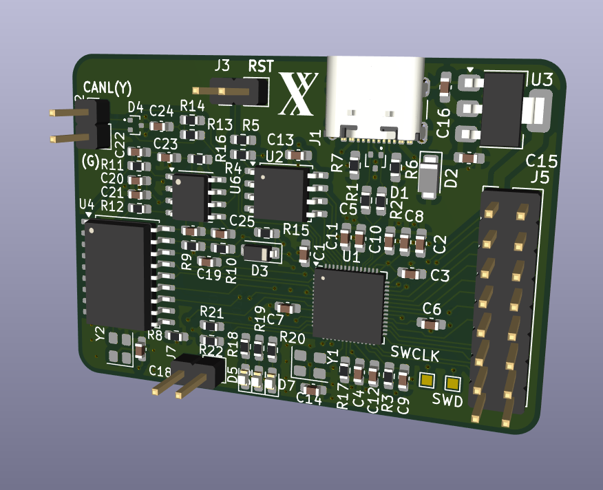

# PixApple

PixApple is designed as a RP2040 breakout board. It features 8 general use GPIOs, 1 SPI interface, 1 I2C interface, 4 ADC channels, 4 PWM channels and a CAN bus.
I designed it because I wanted a board that I could use for general purpose robotics projects. Being from FRC, a CAN bus was a must so I added the CAN bus onto the RP2040 with split terminations.
The Roborio is like 2000CAD so it's so far out of reach its funny. Of course, I don't need the real time OS or the robust nature of the thing, I just want to drive a lil car or something. So I created this!
Building this project really gave me a greater understanding of what went on undernearth the Roborio (I never did open it) and everything actually kinda makes sense now.
I chose the RP2040 because it is cheap, decently powerful for the basic robotics I plan on doing with it and is also what I'm used to.
Additionally, I chose the 0603 SMT format because I wanted to be able to fix any problems I have later on with this board.
This being V1.0, many of the values are not tested and I wanted the ability to fix them if anything happened.
Finally, there are test points scattered around the board for easy debugging.

## What I've gained

Total time spent: 51 hours (I'm still so slow at KiCAD) (the redo didn't help)

This is my first semi-intermediate project and I wanted to learn more about ICs in general. I've incorporated: wide power traces, equal length wires and a ground pour on top and bottom in this project.

## BOM

I know this is quite a high BOM but I don't have any components. istg it'll be so much cheaper from now on.

| Quantity | Value                       | Cost  | URL                                                   |
| -------- | --------------------------- | ----- | ----------------------------------------------------- |
| 17       | Capacitor 100n              | 0.068 | https://www.aliexpress.com/item/1005002782324319.html |
| 3        | Capacitor 1u                | 0.012 | https://www.aliexpress.com/item/1005002782324319.html |
| 2        | Capacitor 10n               | 0.008 | https://www.aliexpress.com/item/1005002782324319.html |
| 2        | Capacitor 10u               | 0.008 | https://www.aliexpress.com/item/1005002782324319.html |
| 1        | Capacitor 4.7n              | 0.004 | https://www.aliexpress.com/item/1005002782324319.html |
| 2        | TVS Diode RCLAMP0502BA      |       |                                                       |
| 1        | SMF5V0A                     |       |                                                       |
| 1        | 1N4148W                     |       |                                                       |
| 3        | LED                         |       |                                                       |
| 1        | USB_C_Receptacle_USB2.0_16P |       |                                                       |
| 3        | Conn_01x02_Pin              |       |                                                       |
| 1        | Conn_02x08_Odd_Even         |       |                                                       |
| 2        | Resistor 27R                |       |                                                       |
| 3        | Resistor 1K                 |       |                                                       |
| 5        | Resistor DNF                |       |                                                       |
| 2        | Resistor 60R                |       |                                                       |
| 5        | Resistor 10K                |       |                                                       |
| 3        | Resistor 220R               |       |                                                       |
| 2        | Resistor 5.1K               |       |                                                       |
| 1        | RP2040                      |       |                                                       |
| 1        | W25Q128JVS                  |       |                                                       |
| 1        | NCP1117-3.3_SOT223          |       |                                                       |
| 1        | MCP2515-xSO                 |       |                                                       |
| 1        | TCAN337G                    |       |                                                       |
| 1        | ASE-12MHz                   |       |                                                       |
| 1        | ASE-16MHz                   |       |                                                       |
