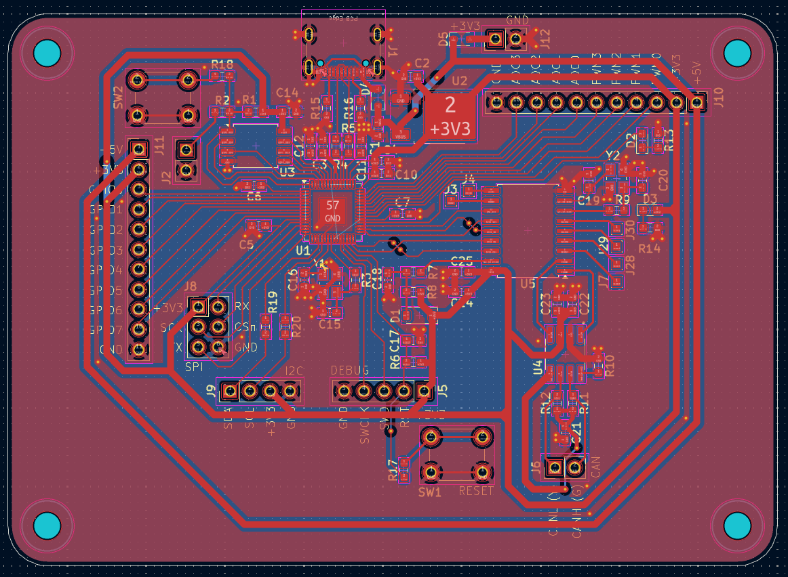

# PixApple

PixApple is designed as a RP2040 breakout board. It features 8 general use GPIOs, 1 SPI interface, 1 I2C interface, 4 ADC channels, 4 PWM channels and a CAN bus.
I designed it because I wanted a board that I could use for general purpose robotics projects. Being from FRC, a CAN bus was a must so I added the CAN bus onto the RP2040 with split terminations.
The Roborio is like 2000CAD so it's so far out of reach its funny. Of course, I don't need the real time OS or the robust nature of the thing, I just want to drive a lil car or something. So I created this!
Building this project really gave me a greater understanding of what went on undernearth the Roborio (I never did open it) and everything actually kinda makes sense now.
I chose the RP2040 because it is cheap, decently powerful for the basic robotics I plan on doing with it and is also what I'm used to.
Additionally, I chose the 0603 SMT format because I wanted to be able to fix any problems I have later on with this board.
This being V1.0, many of the values are not tested and I wanted the ability to fix them if anything happened.
Finally, there are test points scattered around the board for easy debugging.

## What I've gained

Total time spent: 35 hours (I'm still so slow at KiCAD)

This is my first semi-intermediate project and I wanted to learn more about ICs in general. I've incorporated: wide power traces, equal length wires and a ground pour on top and bottom in this project.

Case design coming soon! Check out the Case/ subdirectory!

## BOM

I know this is quite a high BOM but I don't have any components. istg it'll be so much cheaper from now on.

| Footprint                                               | Quantity | Value | Buy amount                                                                       | Link                                                  |
| ------------------------------------------------------- | -------- | ----- | -------------------------------------------------------------------------------- | ----------------------------------------------------- |
| Capacitor Set                                           | 1        | 10.00 | 50 of each value                                                                 | https://www.aliexpress.com/item/1005002782324319.html |
| >>> Capacitor 0603 (10u)                                | 2        | ^     | X                                                                                |                                                       |
| >>> Capacitor 0603 (1u)                                 | 4        | ^     | X                                                                                |                                                       |
| >>> Capacitor 0603 (100n)                               | 11       | ^     | X                                                                                |                                                       |
| >>> Capacitor 0603 (15p)                                | 2        | ^     | X                                                                                |                                                       |
| >>> Capacitor 0603 (30p)                                | 2        | ^     | X                                                                                |                                                       |
| >>> Capacitor 0603 (4.7n)                               | 1        | ^     | X                                                                                |                                                       |
| Diode D_SOD-123 (1N4148W)                               | 7        | 5.00  | 500 (I need this for my next project, I'm willing to pay for this one by myself) | https://www.aliexpress.com/item/4000685043735.html    |
| Shottsky diode D_SOD-323 (1N5819WS)                     | 2        | 4.00  | 100                                                                              | https://www.aliexpress.com/item/1005006207828437.html |
| LED 0603                                                | 2        | 3.50  | 100                                                                              | https://www.aliexpress.com/item/1005008127880619.html |
| USB_C_Receptacle_GCT_USB4105-xx-A_16P_TopMnt_Horizontal | 1        | 3.00  | 10                                                                               | https://www.aliexpress.com/item/1005008515699009.html |
| Male Pins 2.54mm                                        | 50       | 4.00  | 400                                                                              | https://www.aliexpress.com/item/4001198421663.html    |
| Resistor Set Low Values                                 | 2        | 5.00  | 20 per value                                                                     | https://www.aliexpress.com/item/1005007902452631.html |
| >>> Resistor 0603 (27R)                                 | 2        | ^     | X                                                                                |                                                       |
| >>> Resistor 0603 (60R)                                 | 2        | ^     | X                                                                                |                                                       |
| >>> Resistor 0603 (220R)                                | 2        | ^     | X                                                                                |                                                       |
| >>> Resistor 0603 (1k)                                  | 6        | ^     | X                                                                                |                                                       |
| >>> Resistor 0603 (4.7K)                                | 2        | ^     | X                                                                                |                                                       |
| >>> Resistor 0603 (5.1K)                                | 2        | ^     | X                                                                                |                                                       |
| >>> Resistor 0603 (10k)                                 | 4        | ^     | X                                                                                |                                                       |
| Push button 6mm x 6mm                                   | 2        | 2.50  | 50                                                                               | https://www.aliexpress.com/item/32815969627.html      |
| RP2040 --- QFN-56-1EP_7x7mm_P0.4mm_EP3.2x3.2mm          | 1        | X     |                                                                                  | JLCPCB Assembly                                       |
| W25Q128JVS --- SOIC-8_5.3x5.3mm_P1.27mm                 | 1        | X     |                                                                                  | JLCPCB Assembly                                       |
| NCP1117-3.3_TO252 --- TO-252-2                          | 1        | X     |                                                                                  | JLCPCB Assembly                                       |
| SN65HVD230DR --- SOIC127P599X175-8N                     | 1        | X     |                                                                                  | JLCPCB Assembly                                       |
| MCP2515-xSO --- SOIC-18W_7.5x11.6mm_P1.27mm             | 1        | X     |                                                                                  | JLCPCB Assembly                                       |
| ABM8-272-T3 --- XTAL_ABM8-272-T3                        | 1        | X     |                                                                                  | JLCPCB Assembly                                       |
| ABM8-16.000MHZ-B2-T --- XTAL_ABM8-16.000MHZ-B2-T        | 1        | X     |                                                                                  | JLCPCB Assembly                                       |
| JLCPCB Assembled PCB                                    | 1        | 58    |                                                                                  | JLCPCB Assembly                                       |

Total cost: ~100CAD (Most of this is just because I have no 0603's at all. I pinky promise all my future projects will be infinitely cheaper)
